# 个人信息管理系统项目代码运行文档

## 1. 文档说明

本文档基于当前已修改后的项目代码编写，用于说明个人信息管理系统的整体结构、代码运行逻辑、各功能模块流程、数据保存方式以及考核展示时的讲解重点。

当前版本已经修复消费管理和成绩管理中原本无法使用的功能，菜单中的修改、删除、显示全部功能都已经接入前端：

- 消费记录管理：添加、查找、修改、删除、显示所有记录、消费总额统计。
- 成绩管理：添加、查找、修改、删除、显示所有成绩、成绩统计。
- 学生信息管理：添加、查找、修改、删除、显示所有学生。

## 2. 项目整体功能

本项目是一个基于 C 语言开发的命令行个人信息管理系统，主要围绕学生个人信息展开管理。

系统包括三个主要业务模块：

| 模块 | 功能 |
| --- | --- |
| 学生信息管理 | 添加学生、查找学生、修改学生、删除学生、显示所有学生 |
| 消费记录管理 | 添加消费、查找消费、修改消费、删除消费、显示所有消费、统计消费总额 |
| 成绩管理 | 添加成绩、查找成绩、修改成绩、删除成绩、显示所有成绩、统计总分和平均分 |

系统使用结构体保存数据，使用数组在程序运行期间管理数据，使用二进制文件实现数据持久化。

## 3. 项目目录结构

```text
PersonalInfoSystem
├── backend
│   ├── backend_main.c
│   └── src
│       ├── api
│       │   └── backend_api.c
│       ├── core
│       │   ├── student_manager.c
│       │   ├── consumption_manager.c
│       │   └── course_manager.c
│       └── storage
│           └── file_storage.c
├── frontend
│   └── frontend_main.c
├── include
│   ├── common.h
│   ├── common.c
│   ├── date_structures.h
│   └── interfaces.h
├── data
│   ├── students.dat
│   ├── consumptions.dat
│   └── courses.dat
├── frontend.exe
├── 启动脚本.bat
├── Makefile
└── Makefile.win
```

各文件作用如下：

| 文件 | 作用 |
| --- | --- |
| `frontend/frontend_main.c` | 程序实际入口，负责菜单显示、用户输入、功能分发、结果输出。 |
| `backend/src/api/backend_api.c` | 后端 API 层，把各业务函数统一绑定到 `BackendAPI` 结构体。 |
| `backend/src/core/student_manager.c` | 学生信息业务逻辑，实现学生增删改查。 |
| `backend/src/core/consumption_manager.c` | 消费记录业务逻辑，实现消费记录增删改查和统计。 |
| `backend/src/core/course_manager.c` | 课程成绩业务逻辑，实现成绩增删改查和统计。 |
| `backend/src/storage/file_storage.c` | 文件存储层，负责 `.dat` 二进制文件读写。 |
| `include/common.h` | 公共常量、文件路径、返回值类型、工具函数声明。 |
| `include/date_structures.h` | 定义学生、消费、课程三个核心结构体。 |
| `include/interfaces.h` | 定义前端调用后端时使用的 `BackendAPI` 接口结构体。 |
| `include/common.c` | 实现清屏、暂停、获取当前日期等公共函数。 |

## 4. 系统整体架构图

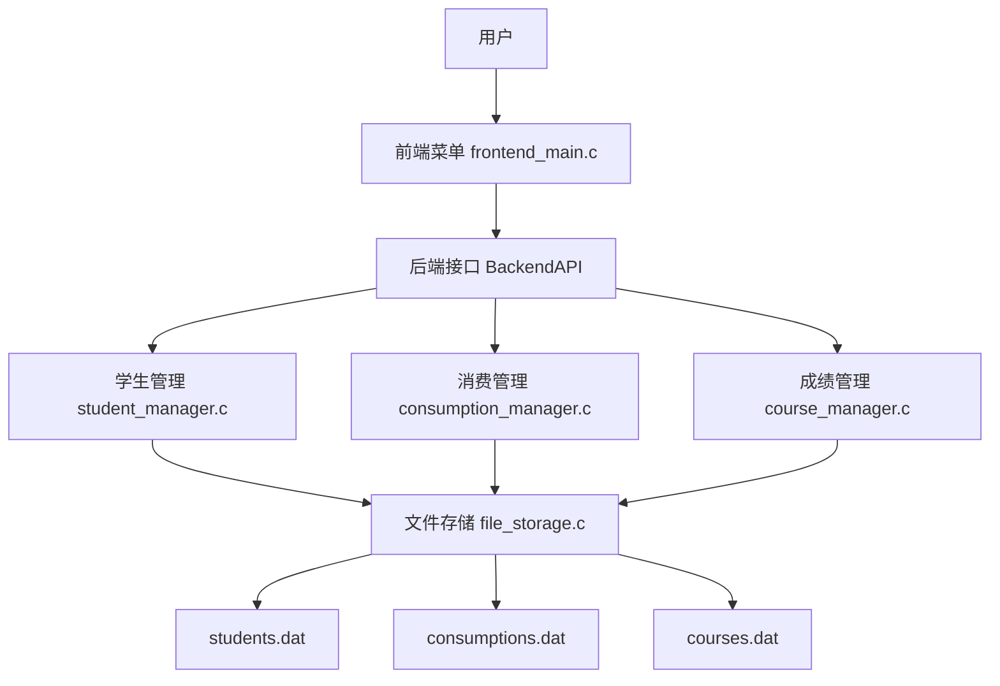

系统可以分为四层：

1. 用户交互层：显示菜单、读取输入、输出结果。
2. API 接口层：用 `BackendAPI` 统一封装后端函数。
3. 业务逻辑层：分别处理学生、消费、成绩三个模块。
4. 文件存储层：把内存数组写入文件，也从文件读取历史数据。

## 5. 核心数据结构

### 5.1 学生结构体

```c
typedef struct {
    char name[50];
    char id[20];
    char gender[10];
    char birth[20];
    char major[50];
    char hobby[100];
} Student;
```

说明：

- `id` 是学号，是学生的唯一标识。
- 查找、修改、删除学生时都通过学号定位。
- 消费记录和课程成绩也通过学号与学生建立关联。

### 5.2 消费记录结构体

```c
typedef struct {
    char studentId[20];
    float amount;
    char description[100];
    char date[20];
} Consumption;
```

说明：

- `studentId` 表示该消费记录属于哪名学生。
- `amount` 保存消费金额。
- `description` 保存消费说明。
- `date` 保存消费日期，添加消费时默认由程序自动获取当前日期。

### 5.3 课程成绩结构体

```c
typedef struct {
    char studentId[20];
    char courseName[50];
    float score;
    char semester[20];
} Course;
```

说明：

- `studentId` 表示该课程成绩属于哪名学生。
- `courseName` 保存课程名称。
- `score` 保存成绩。
- `semester` 保存学期。

### 5.4 容量限制

```c
#define MAX_STUDENTS 100
#define MAX_CONSUMPTION 500
#define MAX_COURSES 200
```

项目使用静态数组保存运行时数据，所以每类数据都有最大容量限制。

## 6. 程序启动流程

程序实际运行入口是 `frontend/frontend_main.c` 中的 `main()` 函数。

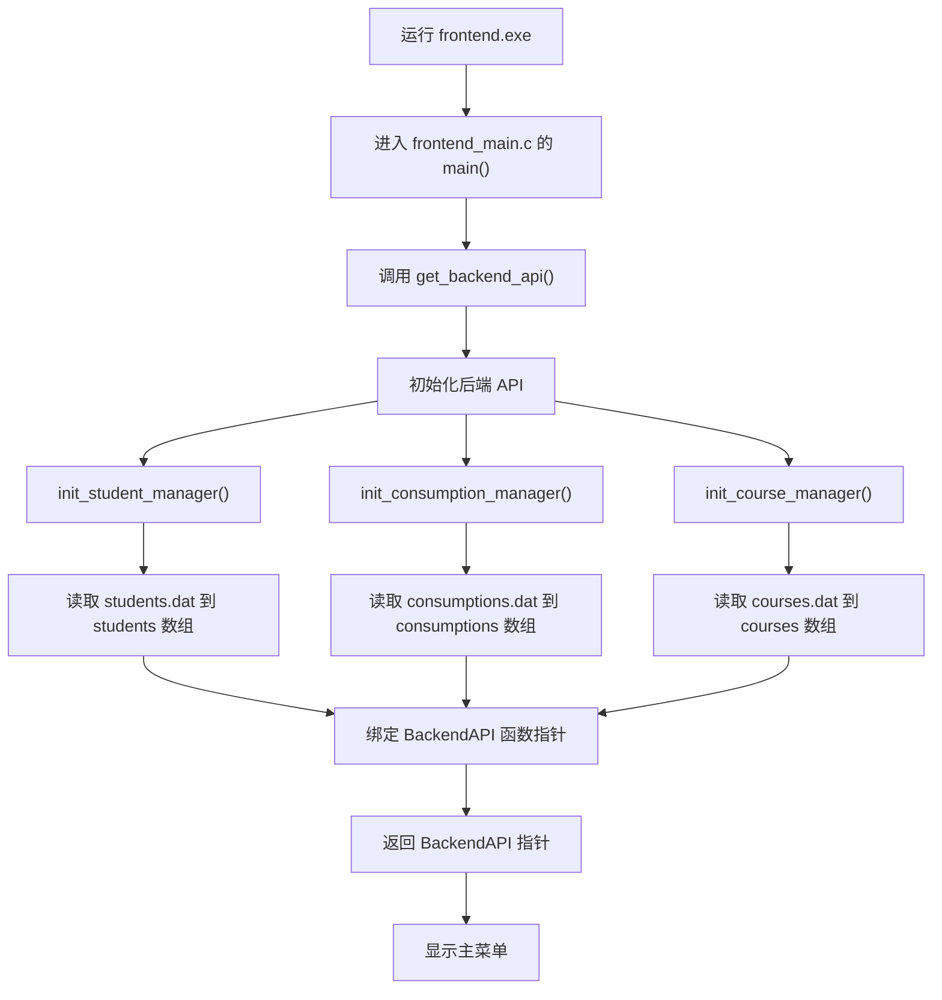

详细过程：

1. 用户运行 `frontend.exe`。
2. 程序进入前端 `main()` 函数。
3. 前端调用 `get_backend_api()` 获取后端接口。
4. 后端调用 `init_backend_api()` 初始化三个管理器。
5. 学生、消费、成绩管理器分别从对应 `.dat` 文件读取数据。
6. 后端把各业务函数绑定到 `BackendAPI` 结构体。
7. 前端获得 `BackendAPI *api` 后进入主菜单循环。

## 7. 主菜单运行逻辑

主菜单如下：

```text
=== 个人信息管理系统 ===
1. 学生信息管理
2. 消费记录管理
3. 成绩管理
0. 退出系统
========================
```

运行逻辑图：

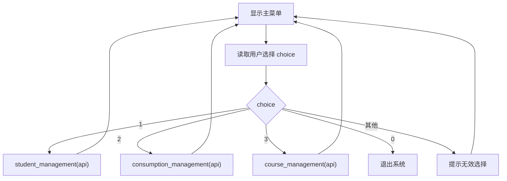

主菜单使用 `do while` 循环实现。只要用户没有输入 `0`，程序就会继续回到菜单。

## 8. 后端 API 运行逻辑

`BackendAPI` 是前端调用后端的统一接口，它本质上是一个保存函数指针的结构体。

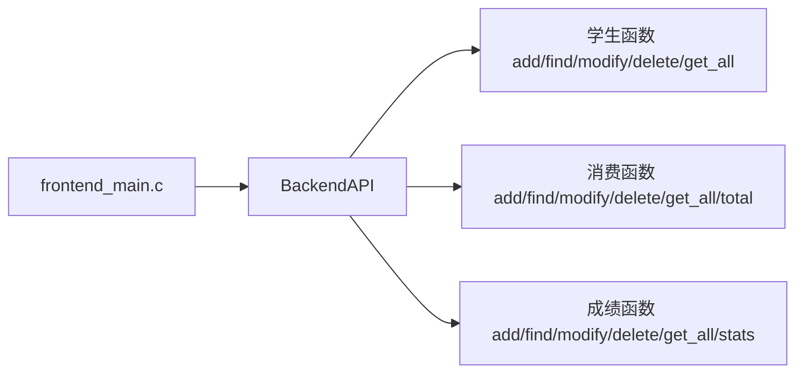

前端调用方式示例：

```c
api->add_student(student);
api->find_consumptions(id, consumptions, &count);
api->modify_course(id, index, course);
```

这种设计的作用是让前端只依赖统一接口，不直接关心函数具体写在哪个源文件里。

## 9. 学生信息管理流程

学生菜单如下：

```text
=== 学生信息管理 ===
1. 添加学生信息
2. 查找学生信息
3. 修改学生信息
4. 删除学生信息
5. 显示所有学生
0. 返回主菜单
========================
```

### 9.1 添加学生

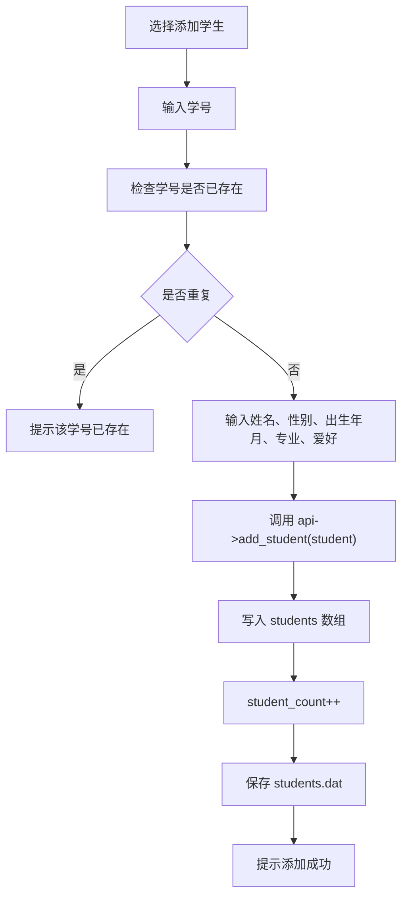

核心代码逻辑：

```c
if (student_count >= MAX_STUDENTS) return FAIL;
if (find_student_index(student.id) != -1) return DUPLICATE;

students[student_count++] = student;
return save_students_to_file(students, student_count);
```

### 9.2 查找学生

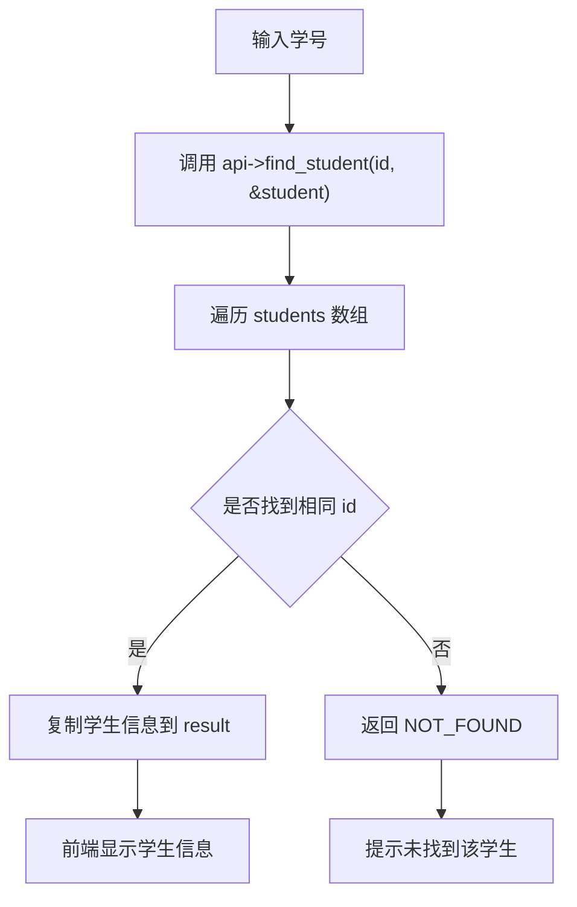

### 9.3 修改学生

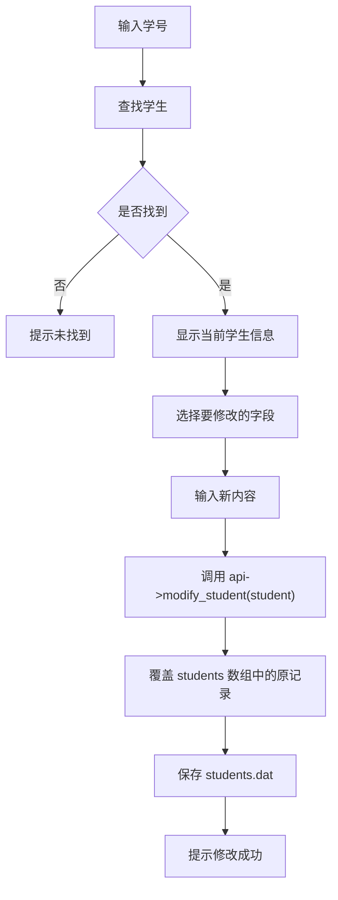

当前学生模块允许修改姓名、性别、出生年月、专业、爱好，不修改学号。因为学号是唯一标识，也是消费和成绩模块的关联字段。

### 9.4 删除学生

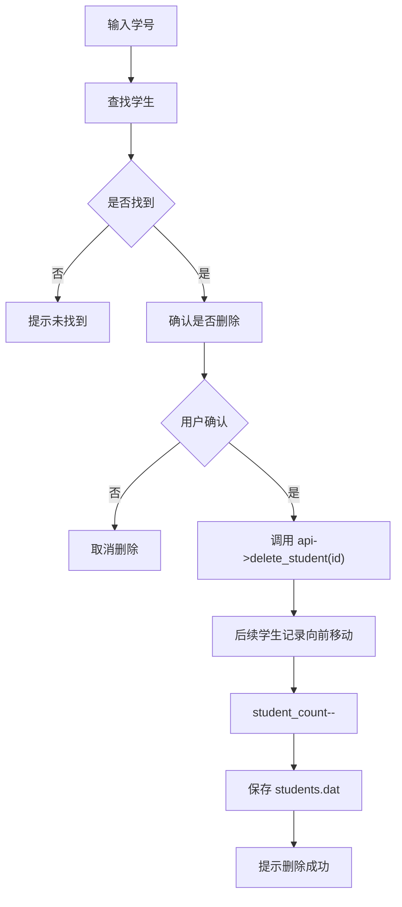

删除学生时采用数组元素前移覆盖的方式，避免数组中出现空位。

### 9.5 显示所有学生

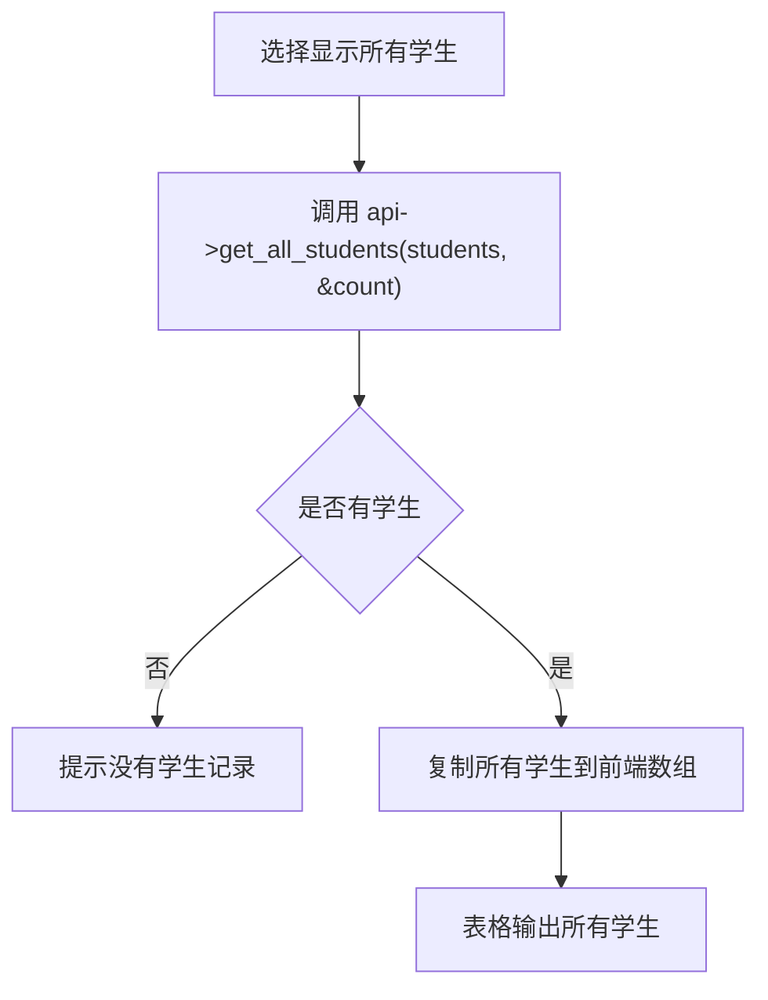

## 10. 消费记录管理流程

消费菜单如下：

```text
=== 消费记录管理 ===
1. 添加消费记录
2. 查找消费记录
3. 修改消费记录
4. 删除消费记录
5. 显示所有记录
6. 消费总额统计
0. 返回主菜单
========================
```

当前版本中，以上 1 到 6 号功能都已经可以正常使用。

### 10.1 添加消费记录

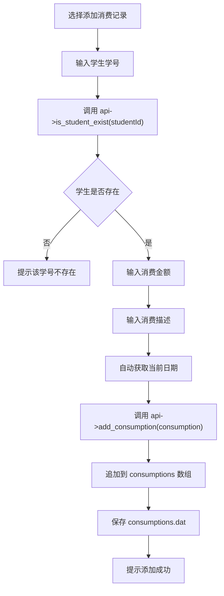

说明：

- 添加消费记录前必须先存在对应学生。
- 消费日期由 `get_current_date()` 自动生成。

### 10.2 查找消费记录

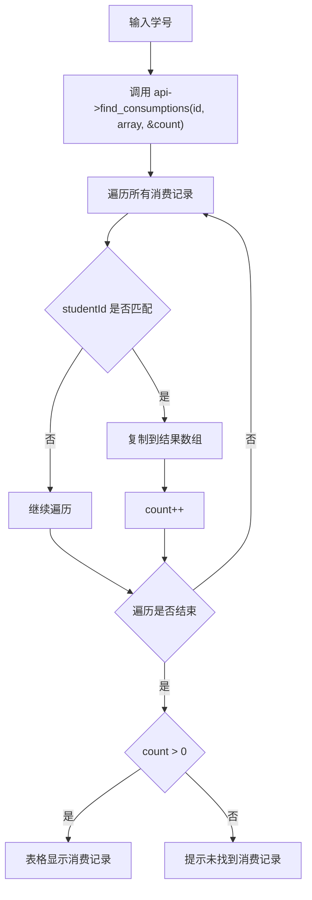

### 10.3 修改消费记录

修改消费记录是本次修复后新增接入前端的功能。

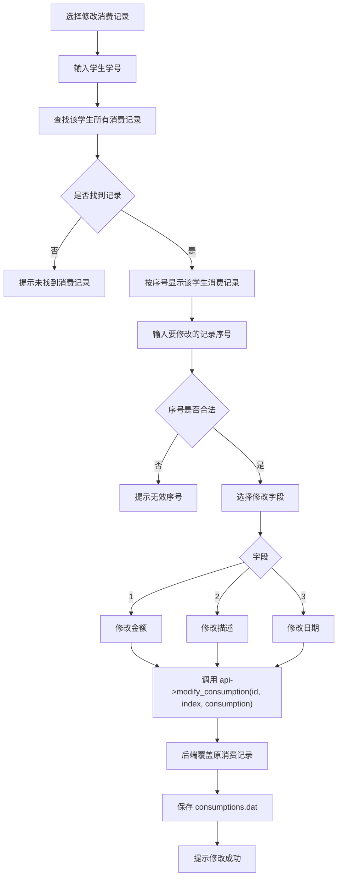

实现特点：

- 前端先调用 `find_consumptions()` 找出该学生所有消费记录。
- 显示时使用从 `1` 开始的序号。
- 后端修改时使用 `index - 1`，也就是从 `0` 开始的相对序号。
- 可修改字段包括金额、描述和日期。

### 10.4 删除消费记录

删除消费记录也是本次修复后新增接入前端的功能。

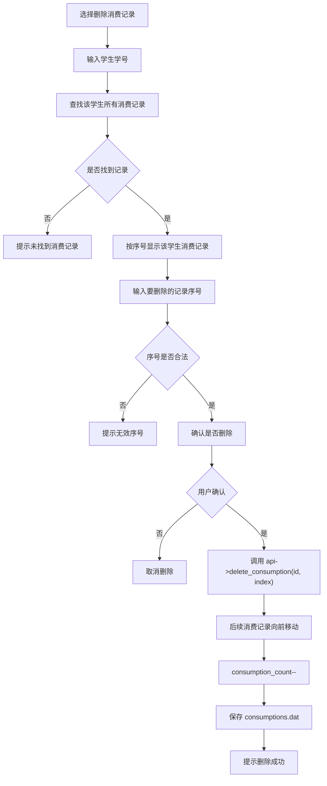

后端删除逻辑会先根据学号和相对序号找到真实数组下标，然后把后续元素向前移动。

### 10.5 显示所有消费记录

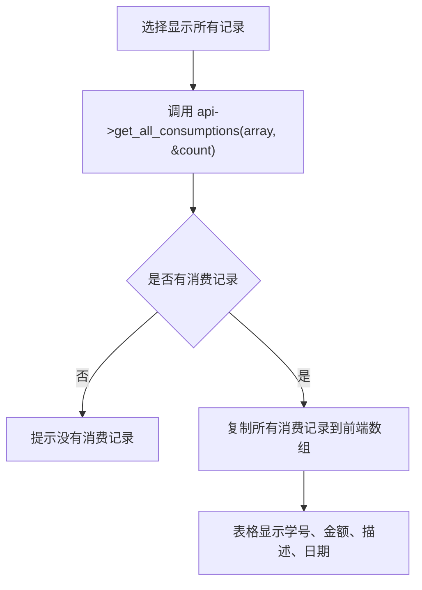

该功能用于展示系统中保存的全部消费记录，不限制某一个学生。

### 10.6 消费总额统计

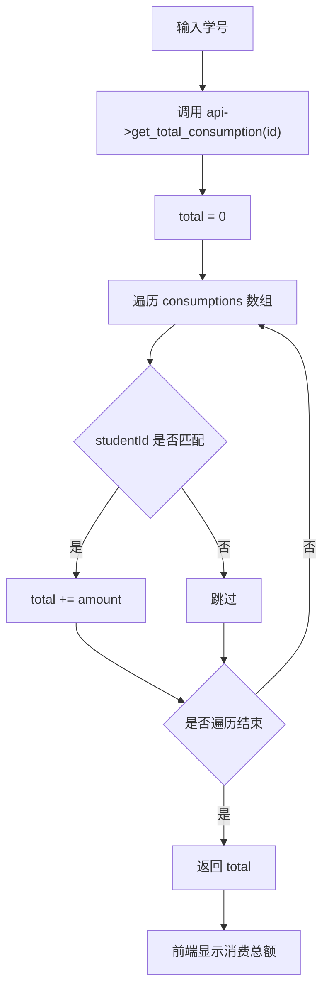

核心代码逻辑：

```c
float total = 0.0f;

for (int i = 0; i < consumption_count; i++) {
    if (strcmp(consumptions[i].studentId, id) == 0) {
        total += consumptions[i].amount;
    }
}

return total;
```

## 11. 课程成绩管理流程

成绩菜单如下：

```text
=== 成绩管理 ===
1. 添加课程成绩
2. 查找课程成绩
3. 修改课程成绩
4. 删除课程成绩
5. 显示所有成绩
6. 成绩统计
0. 返回主菜单
========================
```

当前版本中，以上 1 到 6 号功能都已经可以正常使用。

### 11.1 添加课程成绩

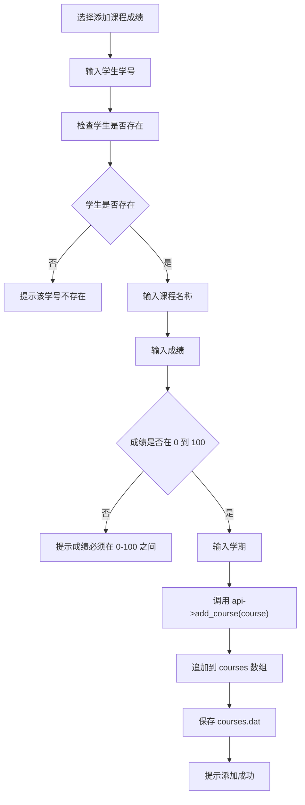

说明：

- 添加成绩前必须先存在对应学生。
- 成绩必须在 `0` 到 `100` 之间。

### 11.2 查找课程成绩

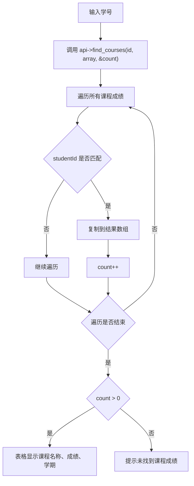

### 11.3 修改课程成绩

修改课程成绩是本次修复后新增接入前端的功能。

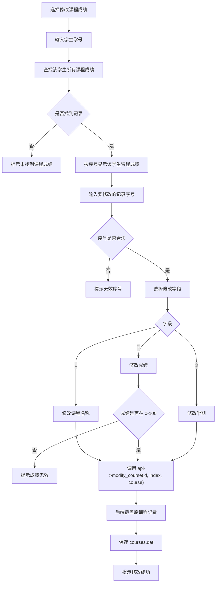

实现特点：

- 前端先列出该学生所有课程成绩。
- 用户通过序号选择要修改哪一条。
- 可修改字段包括课程名称、成绩、学期。
- 修改成绩时仍然检查是否在 `0` 到 `100` 之间。

### 11.4 删除课程成绩

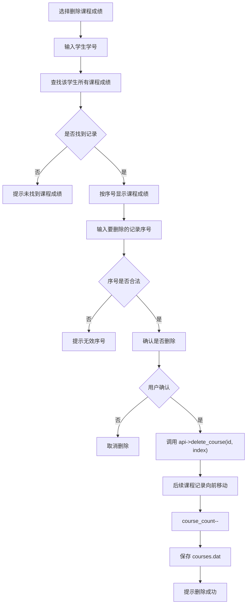

### 11.5 显示所有课程成绩

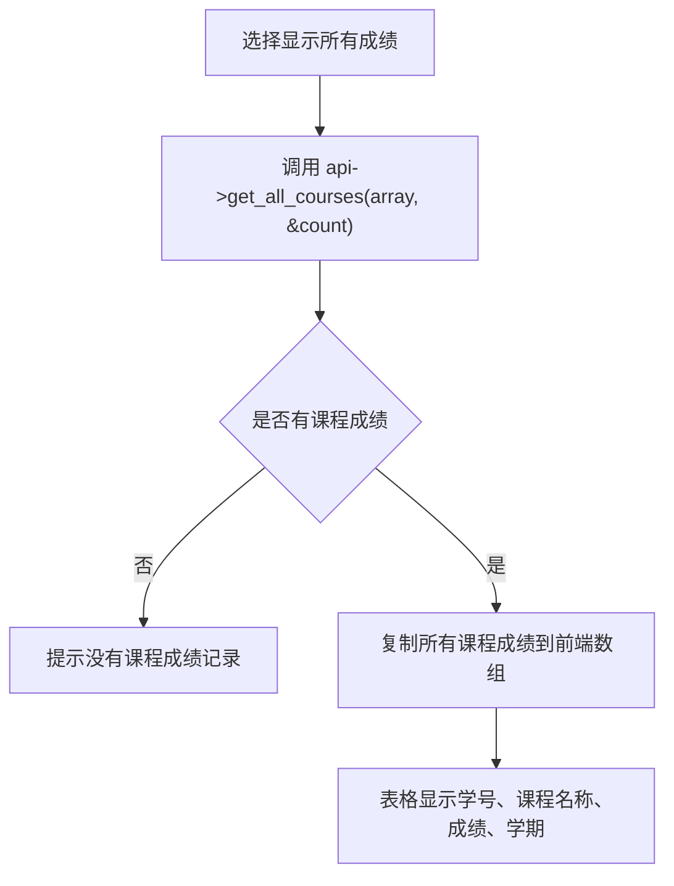

### 11.6 成绩统计

```mermaid
flowchart TD
    A["输入学号"] --> B["调用 api->get_course_stats(id, &total, &avg, &count)"]
    B --> C["total = 0, count = 0"]
    C --> D["遍历 courses 数组"]
    D --> E{studentId 是否匹配}
    E -->|是| F["total += score"]
    F --> G["count++"]
    E -->|否| H["跳过"]
    G --> I{是否遍历结束}
    H --> I
    I -->|否| D
    I -->|是| J{count > 0}
    J -->|是| K["avg = total / count"]
    J -->|否| L["avg = 0"]
    K --> M["显示课程数、总分、平均分"]
    L --> M
```

核心代码逻辑：

```c
*total = 0.0f;
*count = 0;

for (int i = 0; i < course_count; i++) {
    if (strcmp(courses[i].studentId, id) == 0) {
        *total += courses[i].score;
        (*count)++;
    }
}

*avg = (*count > 0) ? (*total / *count) : 0.0f;
```

## 12. 文件读写流程

文件存储模块位于 `backend/src/storage/file_storage.c`。

系统维护三个二进制文件：

| 文件 | 内容 |
| --- | --- |
| `data/students.dat` | 学生基本信息 |
| `data/consumptions.dat` | 消费记录 |
| `data/courses.dat` | 课程成绩 |

### 12.1 保存文件流程

```mermaid
flowchart TD
    A["业务模块调用 save_xxx_to_file()"] --> B["以 wb 模式打开文件"]
    B --> C{是否打开成功}
    C -->|否| D["返回 FAIL"]
    C -->|是| E["写入记录数量 count"]
    E --> F["写入结构体数组"]
    F --> G["关闭文件"]
    G --> H["返回 SUCCESS"]
```

保存时先写记录数量，再写结构体数组。

```c
fwrite(&count, sizeof(int), 1, fp);
fwrite(students, sizeof(Student), count, fp);
```

### 12.2 加载文件流程

```mermaid
flowchart TD
    A["初始化管理器"] --> B["调用 load_xxx_from_file()"]
    B --> C["以 rb 模式打开文件"]
    C --> D{文件是否存在}
    D -->|否| E["count = 0"]
    E --> F["返回 SUCCESS"]
    D -->|是| G["读取记录数量 count"]
    G --> H["限制 count 不超过最大容量"]
    H --> I["读取结构体数组"]
    I --> J["关闭文件"]
    J --> K["返回 SUCCESS"]
```

如果文件不存在，系统不会报错，而是认为当前没有历史数据。

### 12.3 二进制文件结构示意图

```text
students.dat
┌────────────┬────────────┬────────────┬────────────┐
│ count: int │ Student 1  │ Student 2  │ Student n  │
└────────────┴────────────┴────────────┴────────────┘

consumptions.dat
┌────────────┬────────────────┬────────────────┬────────────────┐
│ count: int │ Consumption 1  │ Consumption 2  │ Consumption n  │
└────────────┴────────────────┴────────────────┴────────────────┘

courses.dat
┌────────────┬──────────┬──────────┬──────────┐
│ count: int │ Course 1 │ Course 2 │ Course n │
└────────────┴──────────┴──────────┴──────────┘
```

## 13. 一次完整操作时序图

下面以一次完整演示为例，展示用户、前端、后端、文件之间的调用关系。

```mermaid
sequenceDiagram
    participant U as 用户
    participant F as 前端 frontend_main.c
    participant A as BackendAPI
    participant S as 学生管理
    participant C as 消费管理
    participant G as 成绩管理
    participant File as 数据文件

    U->>F: 添加学生
    F->>A: api->add_student(student)
    A->>S: add_student(student)
    S->>File: save_students_to_file()

    U->>F: 添加消费记录
    F->>A: api->is_student_exist(id)
    A->>S: is_student_exist(id)
    F->>A: api->add_consumption(consumption)
    A->>C: add_consumption(consumption)
    C->>File: save_consumptions_to_file()

    U->>F: 修改消费记录
    F->>A: api->find_consumptions(id, array, &count)
    F->>A: api->modify_consumption(id, index, consumption)
    A->>C: modify_consumption(id, index, consumption)
    C->>File: save_consumptions_to_file()

    U->>F: 添加课程成绩
    F->>A: api->is_student_exist(id)
    A->>S: is_student_exist(id)
    F->>A: api->add_course(course)
    A->>G: add_course(course)
    G->>File: save_courses_to_file()

    U->>F: 删除课程成绩
    F->>A: api->find_courses(id, array, &count)
    F->>A: api->delete_course(id, index)
    A->>G: delete_course(id, index)
    G->>File: save_courses_to_file()

    U->>F: 查看统计结果
    F->>A: api->get_total_consumption(id)
    F->>A: api->get_course_stats(id)
    A-->>F: 返回统计结果
    F-->>U: 显示结果
```

## 14. 推荐考核演示顺序

为了避免演示时逻辑跳跃，建议按以下顺序展示：

1. 启动程序，进入主菜单。
2. 进入学生信息管理，添加一名学生。
3. 查找该学生，确认添加成功。
4. 修改学生信息，例如专业或爱好。
5. 显示所有学生。
6. 进入消费记录管理，添加该学生的一条消费记录。
7. 查找该学生的消费记录。
8. 修改该消费记录，例如金额或描述。
9. 显示所有消费记录。
10. 统计该学生消费总额。
11. 删除一条消费记录，展示删除功能。
12. 进入成绩管理，添加该学生的一门课程成绩。
13. 查找该学生课程成绩。
14. 修改课程成绩，例如分数或学期。
15. 显示所有课程成绩。
16. 统计该学生课程数量、总分和平均分。
17. 删除一条课程成绩，展示删除功能。
18. 返回主菜单并退出系统。

## 15. 编译和运行方式

### 15.1 使用启动脚本

Windows 下可以直接运行：

```bat
启动脚本.bat
```

脚本会自动完成：

1. 检查 GCC 是否可用。
2. 创建 `data` 目录。
3. 删除旧的 `frontend.exe`。
4. 编译全部源文件。
5. 启动系统。

### 15.2 手动编译

在项目根目录执行：

```bat
gcc frontend/frontend_main.c backend/src/api/backend_api.c backend/src/core/student_manager.c backend/src/core/consumption_manager.c backend/src/core/course_manager.c backend/src/storage/file_storage.c include/common.c -Iinclude -o frontend.exe
```

运行：

```bat
frontend.exe
```

## 16. 当前版本代码特点

### 16.1 已完成功能

- 学生信息模块已经实现完整增删改查。
- 消费记录模块已经实现添加、查找、修改、删除、显示全部、统计总额。
- 成绩管理模块已经实现添加、查找、修改、删除、显示全部、统计平均分。
- 后端业务函数通过 `BackendAPI` 统一提供给前端。
- 每次添加、修改、删除后都会保存到对应 `.dat` 文件。

### 16.2 代码优点

- 模块分层清晰，前端、API、业务、存储职责明确。
- 使用结构体保存实体数据，符合 C 语言课程要求。
- 使用数组、指针、函数指针、文件读写、循环、条件判断等知识点。
- 消费和成绩模块添加记录前会校验学生是否存在，保证基本关联关系。
- 修改和删除消费、成绩时先列出记录并编号，用户操作更清楚。

### 16.3 仍可继续优化的地方

- 删除学生时，目前不会自动删除该学生已有的消费记录和成绩记录。
- 消费金额目前只检查是否为数字，可以进一步限制必须大于 `0`。
- `file_storage.c` 中 `ensure_data_dir()` 当前为空，如果 `data` 目录不存在，保存文件可能失败；启动脚本中已经创建了 `data` 目录。
- 根目录 `Makefile` 中存在路径拼写问题，建议优先使用 `启动脚本.bat` 或手动编译命令。

## 17. 考核讲解稿

现场可以这样介绍项目：

本项目是一个使用 C 语言实现的命令行个人信息管理系统，主要包括学生信息管理、消费记录管理和课程成绩管理三个模块。程序启动时，前端会调用 `get_backend_api()` 初始化后端接口，后端会从三个 `.dat` 文件中读取已有数据到静态数组中。用户进入菜单后，前端根据输入调用 `BackendAPI` 中对应的函数，具体业务由学生、消费、成绩三个管理器完成。

例如添加学生时，程序先判断学号是否重复，再把学生结构体加入学生数组，最后保存到 `students.dat`。添加消费和课程成绩时，会先检查学生是否存在，保证记录能关联到有效学生。修改和删除消费、成绩时，前端会先列出该学生已有记录并编号，用户选择序号后，后端根据学号和相对序号定位真实数组元素，完成修改或删除，并立即保存文件。

这个项目主要体现了结构化程序设计思想，使用了结构体、数组、指针、函数指针、文件读写、循环和条件判断等 C 语言知识点。当前版本的学生、消费、成绩三个模块都已经具备完整的增删改查和统计展示功能。
